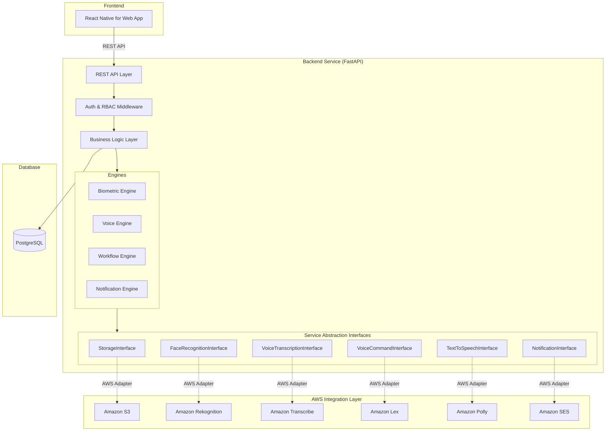
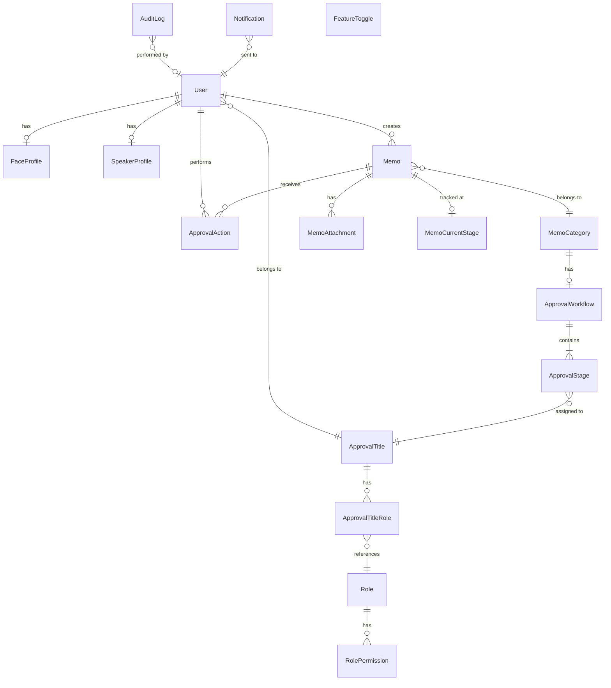

# Design Document: Memo Tracking and Approval System

## Overview

This document describes the technical design for a Document (Memo) Tracking and Approval System for a Nigerian Government Agency. The system enables government staff to create, submit, track, and approve memos through configurable multi-level approval workflows. It features biometric authentication (face + voice), voice-activated memo creation and retrieval, real-time dashboards, and comprehensive audit logging.

### Key Design Decisions

- **Python + FastAPI backend**: FastAPI provides async support, automatic OpenAPI docs, and high performance. It aligns with the requirement for RESTful API documentation (Req 14.3) and backend-frontend separation.
- **PostgreSQL database**: Relational model fits the structured data (memos, workflows, approval stages, users, roles) with strong referential integrity and support for complex queries needed by search/reporting.
- **React Native for Web frontend**: Single codebase for web and mobile (Req 16.1), communicating exclusively through REST APIs.
- **AWS free-tier AI services**: Rekognition (face), Transcribe (speech-to-text), Lex (voice commands), Polly (text-to-speech), S3 (storage), SES (email) — all behind abstraction interfaces so the backend can run without AWS dependencies.
- **Abstraction-first architecture**: All external services (storage, biometrics, voice, notifications) are accessed through Python abstract base classes (ABCs). Local/mock implementations are built first; AWS implementations are swapped in via dependency injection.

### Development Order

1. **Phase 1 — Core Backend**: Business logic, database models, REST APIs, RBAC, audit logging, feature toggles. All external services use local/mock implementations.
2. **Phase 2 — AWS Integration**: Implement AWS adapters for each abstraction interface (S3, Rekognition, Transcribe, Lex, Polly, SES).
3. **Phase 3 — Frontend**: React Native for Web application consuming the REST API.

## Architecture

### High-Level System Architecture



### Layer Responsibilities

| Layer | Responsibility |
|-------|---------------|
| **REST API Layer** | Request routing, input validation (Pydantic), serialization, CORS, OpenAPI docs |
| **Auth & RBAC Middleware** | JWT token validation, role/permission checks, account lockout enforcement |
| **Business Logic Layer** | Memo CRUD, category management, search/filter, dashboard stats, feature toggles, audit logging |
| **Workflow Engine** | Approval stage progression, rejection/revision handling, workflow configuration |
| **Biometric Engine** | Face + voice verification orchestration, enrollment, profile management |
| **Voice Engine** | Speaker verification, transcription, voice command parsing |
| **Notification Engine** | In-app + email notification dispatch, template management |
| **Service Abstractions** | Python ABCs defining contracts for all external services |
| **AWS Integration Layer** | Concrete implementations of abstractions using AWS SDKs (boto3) |

## Components and Interfaces

### Service Abstraction Interfaces

Each external dependency is accessed through a Python ABC. This satisfies Req 15.7 (swappable AWS layer) and enables Phase 1 development without AWS.

```python
# storage_interface.py
from abc import ABC, abstractmethod
from typing import BinaryIO

class StorageInterface(ABC):
    @abstractmethod
    async def upload_file(self, bucket: str, key: str, file: BinaryIO, content_type: str) -> str:
        """Upload a file and return its storage URL."""
        ...

    @abstractmethod
    async def download_file(self, bucket: str, key: str) -> BinaryIO:
        """Download a file by key."""
        ...

    @abstractmethod
    async def delete_file(self, bucket: str, key: str) -> None:
        """Delete a file by key."""
        ...

    @abstractmethod
    async def get_file_url(self, bucket: str, key: str, expires_in: int = 3600) -> str:
        """Generate a pre-signed URL for file access."""
        ...
```

```python
# face_recognition_interface.py
from abc import ABC, abstractmethod
from dataclasses import dataclass

@dataclass
class FaceMatch:
    confidence: float
    face_id: str

class FaceRecognitionInterface(ABC):
    @abstractmethod
    async def detect_faces(self, image_bytes: bytes) -> list[dict]:
        """Detect faces in an image. Returns face details."""
        ...

    @abstractmethod
    async def index_face(self, collection_id: str, image_bytes: bytes, external_id: str) -> str:
        """Index a face into a collection. Returns face_id."""
        ...

    @abstractmethod
    async def compare_faces(self, source_image: bytes, target_image: bytes, threshold: float = 90.0) -> list[FaceMatch]:
        """Compare two face images. Returns match results."""
        ...

    @abstractmethod
    async def search_faces_by_image(self, collection_id: str, image_bytes: bytes, threshold: float = 90.0) -> list[FaceMatch]:
        """Search a collection for matching faces."""
        ...

    @abstractmethod
    async def delete_faces(self, collection_id: str, face_ids: list[str]) -> None:
        """Remove faces from a collection."""
        ...
```

```python
# voice_transcription_interface.py
from abc import ABC, abstractmethod
from dataclasses import dataclass

@dataclass
class TranscriptionResult:
    text: str
    confidence: float
    language_code: str

class VoiceTranscriptionInterface(ABC):
    @abstractmethod
    async def transcribe_audio(self, audio_bytes: bytes, language_code: str = "en-US") -> TranscriptionResult:
        """Transcribe audio to text."""
        ...
```

```python
# voice_command_interface.py
from abc import ABC, abstractmethod
from dataclasses import dataclass

@dataclass
class CommandIntent:
    intent_name: str
    slots: dict[str, str]
    confidence: float

class VoiceCommandInterface(ABC):
    @abstractmethod
    async def parse_command(self, text: str, bot_id: str) -> CommandIntent:
        """Parse a text command into an intent with slots."""
        ...
```

```python
# text_to_speech_interface.py
from abc import ABC, abstractmethod

class TextToSpeechInterface(ABC):
    @abstractmethod
    async def synthesize_speech(self, text: str, voice_id: str = "Aditi", output_format: str = "mp3") -> bytes:
        """Convert text to speech audio bytes."""
        ...
```

```python
# notification_interface.py
from abc import ABC, abstractmethod
from dataclasses import dataclass

@dataclass
class EmailMessage:
    to: list[str]
    subject: str
    body_html: str
    body_text: str

class NotificationInterface(ABC):
    @abstractmethod
    async def send_email(self, message: EmailMessage) -> str:
        """Send an email notification. Returns message ID."""
        ...
```

### Biometric Engine

Orchestrates the two-step biometric login (face then voice) per Req 19.

```python
class BiometricEngine:
    def __init__(
        self,
        face_recognition: FaceRecognitionInterface,
        voice_transcription: VoiceTranscriptionInterface,
        storage: StorageInterface,
    ): ...

    async def enroll_face(self, user_id: str, face_images: list[bytes]) -> FaceEnrollmentResult:
        """Enroll face profile from multiple images (min 3). Validates face detection first."""
        ...

    async def enroll_voice(self, user_id: str, voice_samples: list[bytes]) -> VoiceEnrollmentResult:
        """Enroll voice profile from multiple samples (min 3). Validates audio quality."""
        ...

    async def verify_face(self, user_id: str, live_image: bytes) -> BiometricVerificationResult:
        """Compare live face image against stored Face_Profile."""
        ...

    async def verify_voice(self, user_id: str, audio_bytes: bytes, expected_phrase: str) -> BiometricVerificationResult:
        """Transcribe audio and compare against Speaker_Profile."""
        ...

    async def authenticate(self, user_id: str, face_image: bytes, voice_audio: bytes, expected_phrase: str) -> AuthResult:
        """Full biometric login: face first, then voice. Returns session token on success."""
        ...

    async def reset_profiles(self, user_id: str) -> None:
        """Reset both face and voice profiles (Superuser action)."""
        ...
```

### Voice Engine

Handles voice-to-text memo input and voice-activated retrieval per Reqs 6 and 7.

```python
class VoiceEngine:
    def __init__(
        self,
        transcription: VoiceTranscriptionInterface,
        command_parser: VoiceCommandInterface,
        tts: TextToSpeechInterface,
        biometric_engine: BiometricEngine,
    ): ...

    async def transcribe_memo_content(self, user_id: str, audio_bytes: bytes) -> TranscriptionResult:
        """Verify speaker identity, then transcribe audio for memo field population."""
        ...

    async def parse_retrieval_command(self, user_id: str, audio_bytes: bytes) -> MemoRetrievalQuery:
        """Verify speaker, transcribe, parse intent via Lex, return structured query."""
        ...

    async def read_memo_aloud(self, memo_text: str) -> bytes:
        """Convert memo text to speech audio using Polly."""
        ...
```

### Workflow Engine

Manages configurable approval workflows per Reqs 3 and 5.

```python
class WorkflowEngine:
    async def configure_workflow(self, category_id: str, stages: list[ApprovalStageConfig]) -> Workflow:
        """Create or update an approval workflow for a memo category."""
        ...

    async def submit_memo(self, memo_id: str) -> MemoStatus:
        """Route memo to first approval stage. Validates workflow has stages."""
        ...

    async def approve(self, memo_id: str, approver_id: str, comments: str = "") -> MemoStatus:
        """Advance memo to next stage or mark as Approved if final stage."""
        ...

    async def reject(self, memo_id: str, approver_id: str, reason: str) -> MemoStatus:
        """Mark memo as Rejected with reason."""
        ...

    async def request_revision(self, memo_id: str, approver_id: str, comments: str) -> MemoStatus:
        """Return memo to Submitter with revision comments."""
        ...

    async def get_current_stage(self, memo_id: str) -> ApprovalStageInfo:
        """Get the current approval stage and assigned approver for a memo."""
        ...
```

### Notification Engine

```python
class NotificationEngine:
    def __init__(
        self,
        email_service: NotificationInterface,
        db_session: AsyncSession,
    ): ...

    async def notify_approver(self, approver_id: str, memo_id: str, stage_name: str) -> None:
        """Send in-app + email notification to approver about pending memo."""
        ...

    async def notify_submitter_approved(self, submitter_id: str, memo_id: str) -> None:
        """Notify submitter that memo was fully approved."""
        ...

    async def notify_submitter_rejected(self, submitter_id: str, memo_id: str, reason: str) -> None:
        """Notify submitter of rejection with reason."""
        ...

    async def notify_submitter_revision(self, submitter_id: str, memo_id: str, comments: str) -> None:
        """Notify submitter of revision request with comments."""
        ...
```


### REST API Endpoints

All endpoints are prefixed with `/api/v1`. Authentication is required unless noted.

#### Authentication & Biometrics

| Method | Endpoint | Description | Roles | Req |
|--------|----------|-------------|-------|-----|
| POST | `/auth/login` | Biometric login (face + voice) | Public | 19 |
| POST | `/auth/refresh` | Refresh session token | Authenticated | 19 |
| POST | `/auth/logout` | Invalidate session token | Authenticated | 19 |

#### User Management (Superuser Only)

| Method | Endpoint | Description | Roles | Req |
|--------|----------|-------------|-------|-----|
| POST | `/users` | Register new user | Superuser | 18 |
| GET | `/users` | List users (paginated) | Superuser, Admin | 18 |
| GET | `/users/{id}` | Get user details | Superuser, Admin | 18 |
| PATCH | `/users/{id}` | Update user account | Superuser | 18.7 |
| POST | `/users/{id}/deactivate` | Deactivate user | Superuser | 18.7 |
| POST | `/users/{id}/reactivate` | Reactivate user | Superuser | 18.7 |

#### Biometric Enrollment

| Method | Endpoint | Description | Roles | Req |
|--------|----------|-------------|-------|-----|
| POST | `/users/{id}/face-enrollment` | Submit face images for enrollment | Superuser | 20 |
| POST | `/users/{id}/voice-enrollment` | Submit voice samples for enrollment | Superuser | 20 |
| POST | `/users/{id}/biometric-reset` | Reset biometric profiles | Superuser | 19.9, 20.7 |
| GET | `/users/{id}/enrollment-status` | Check enrollment completion status | Superuser | 20 |

#### Speaker Profile

| Method | Endpoint | Description | Roles | Req |
|--------|----------|-------------|-------|-----|
| POST | `/users/{id}/speaker-profile` | Enroll speaker profile | Superuser | 6.5 |
| PUT | `/users/{id}/speaker-profile` | Update speaker profile | Superuser | 6.5 |

#### Memo Management

| Method | Endpoint | Description | Roles | Req |
|--------|----------|-------------|-------|-----|
| POST | `/memos` | Create a new memo | Submitter | 1 |
| GET | `/memos` | Search/filter memos (paginated) | Authenticated | 12 |
| GET | `/memos/{id}` | Get memo details | Authenticated | 12 |
| PATCH | `/memos/{id}` | Update memo (draft/revision) | Submitter (owner) | 1 |
| POST | `/memos/{id}/submit` | Submit memo to workflow | Submitter (owner) | 1.4 |
| POST | `/memos/{id}/attachments` | Upload attachment | Submitter (owner) | 17 |
| GET | `/memos/{id}/attachments` | List attachments | Authenticated | 17 |
| GET | `/memos/{id}/history` | Get memo approval history | Authenticated | 5 |

#### Voice Input

| Method | Endpoint | Description | Roles | Req |
|--------|----------|-------------|-------|-----|
| POST | `/voice/transcribe` | Transcribe audio for memo field | Authenticated | 6 |
| POST | `/voice/retrieve` | Voice command for memo retrieval | Authenticated | 7 |
| POST | `/voice/read-memo/{id}` | Text-to-speech for memo content | Authenticated | 15.6 |

#### Approval Actions

| Method | Endpoint | Description | Roles | Req |
|--------|----------|-------------|-------|-----|
| GET | `/approvals/pending` | List pending approvals for current user | Approver | 5 |
| POST | `/memos/{id}/approve` | Approve a memo | Approver | 5.2 |
| POST | `/memos/{id}/reject` | Reject a memo | Approver | 5.4 |
| POST | `/memos/{id}/request-revision` | Request revision | Approver | 5.5 |

#### Memo Categories

| Method | Endpoint | Description | Roles | Req |
|--------|----------|-------------|-------|-----|
| POST | `/memo-categories` | Create category | Admin | 2 |
| GET | `/memo-categories` | List categories | Authenticated | 2 |
| GET | `/memo-categories/{id}` | Get category details | Authenticated | 2 |
| PATCH | `/memo-categories/{id}` | Update category | Admin | 2 |
| POST | `/memo-categories/{id}/deactivate` | Deactivate category | Admin | 2.4 |

#### Approval Workflows

| Method | Endpoint | Description | Roles | Req |
|--------|----------|-------------|-------|-----|
| GET | `/memo-categories/{id}/workflow` | Get workflow for category | Admin | 3 |
| PUT | `/memo-categories/{id}/workflow` | Configure workflow stages | Admin | 3 |

#### Approval Titles & Roles

| Method | Endpoint | Description | Roles | Req |
|--------|----------|-------------|-------|-----|
| POST | `/approval-titles` | Create approval title | Admin | 4 |
| GET | `/approval-titles` | List approval titles | Admin | 4 |
| GET | `/approval-titles/{id}` | Get approval title details | Admin | 4 |
| PATCH | `/approval-titles/{id}` | Update approval title | Admin | 4 |
| DELETE | `/approval-titles/{id}` | Delete approval title | Admin | 4 |
| POST | `/roles` | Create custom role | Admin | 11.5 |
| GET | `/roles` | List roles | Admin | 11 |
| PATCH | `/roles/{id}` | Update role permissions | Admin | 11 |

#### Feature Toggles

| Method | Endpoint | Description | Roles | Req |
|--------|----------|-------------|-------|-----|
| GET | `/feature-toggles` | List all toggles | Admin | 8 |
| PATCH | `/feature-toggles/{key}` | Update toggle state | Admin | 8.4 |

#### Audit Log

| Method | Endpoint | Description | Roles | Req |
|--------|----------|-------------|-------|-----|
| GET | `/audit-logs` | Query audit logs (paginated, filtered) | Admin | 9.4 |

#### Dashboard & Reporting

| Method | Endpoint | Description | Roles | Req |
|--------|----------|-------------|-------|-----|
| GET | `/dashboard/stats` | Real-time memo statistics | Admin | 13.1 |
| GET | `/dashboard/pending-by-stage` | Pending memos per stage | Admin | 13.4 |
| GET | `/reports` | Generate filtered reports | Admin | 13.2 |

#### Notifications

| Method | Endpoint | Description | Roles | Req |
|--------|----------|-------------|-------|-----|
| GET | `/notifications` | List user's notifications | Authenticated | 10 |
| PATCH | `/notifications/{id}/read` | Mark notification as read | Authenticated | 10 |

## Data Models

### Entity Relationship Diagram



### Database Tables

#### `users`

| Column | Type | Constraints | Description |
|--------|------|-------------|-------------|
| id | UUID | PK, DEFAULT gen_random_uuid() | Primary key |
| full_name | VARCHAR(255) | NOT NULL | User's full name |
| email | VARCHAR(255) | NOT NULL, UNIQUE | Email address |
| department | VARCHAR(255) | NOT NULL | Government department |
| designation | VARCHAR(255) | NOT NULL | Job designation |
| approval_title_id | UUID | FK → approval_titles.id, NULLABLE | Assigned approval title |
| is_active | BOOLEAN | NOT NULL, DEFAULT TRUE | Account active status |
| is_superuser | BOOLEAN | NOT NULL, DEFAULT FALSE | Superuser flag |
| failed_login_attempts | INTEGER | NOT NULL, DEFAULT 0 | Consecutive failed biometric attempts |
| locked_until | TIMESTAMP | NULLABLE | Account lockout expiry |
| enrollment_status | VARCHAR(20) | NOT NULL, DEFAULT 'pending' | 'pending', 'face_enrolled', 'voice_enrolled', 'complete' |
| created_at | TIMESTAMP | NOT NULL, DEFAULT NOW() | Creation timestamp |
| updated_at | TIMESTAMP | NOT NULL, DEFAULT NOW() | Last update timestamp |

**Indexes:** `idx_users_email` (UNIQUE), `idx_users_approval_title_id`, `idx_users_department`

#### `face_profiles`

| Column | Type | Constraints | Description |
|--------|------|-------------|-------------|
| id | UUID | PK | Primary key |
| user_id | UUID | FK → users.id, UNIQUE, NOT NULL | Owning user |
| collection_id | VARCHAR(255) | NOT NULL | Rekognition collection ID |
| face_ids | JSONB | NOT NULL | Array of indexed face IDs |
| sample_count | INTEGER | NOT NULL | Number of enrolled samples |
| created_at | TIMESTAMP | NOT NULL, DEFAULT NOW() | Enrollment timestamp |
| updated_at | TIMESTAMP | NOT NULL, DEFAULT NOW() | Last update |

**Indexes:** `idx_face_profiles_user_id` (UNIQUE)

#### `speaker_profiles`

| Column | Type | Constraints | Description |
|--------|------|-------------|-------------|
| id | UUID | PK | Primary key |
| user_id | UUID | FK → users.id, UNIQUE, NOT NULL | Owning user |
| sample_keys | JSONB | NOT NULL | S3 keys for voice samples |
| sample_count | INTEGER | NOT NULL | Number of enrolled samples |
| voiceprint_key | VARCHAR(512) | NULLABLE | S3 key for computed voiceprint |
| created_at | TIMESTAMP | NOT NULL, DEFAULT NOW() | Enrollment timestamp |
| updated_at | TIMESTAMP | NOT NULL, DEFAULT NOW() | Last update |

**Indexes:** `idx_speaker_profiles_user_id` (UNIQUE)

#### `memo_categories`

| Column | Type | Constraints | Description |
|--------|------|-------------|-------------|
| id | UUID | PK | Primary key |
| name | VARCHAR(255) | NOT NULL, UNIQUE | Category name |
| description | TEXT | NOT NULL | Category description |
| is_active | BOOLEAN | NOT NULL, DEFAULT TRUE | Active status |
| created_at | TIMESTAMP | NOT NULL, DEFAULT NOW() | Creation timestamp |
| updated_at | TIMESTAMP | NOT NULL, DEFAULT NOW() | Last update |

**Indexes:** `idx_memo_categories_name` (UNIQUE), `idx_memo_categories_is_active`

#### `approval_titles`

| Column | Type | Constraints | Description |
|--------|------|-------------|-------------|
| id | UUID | PK | Primary key |
| name | VARCHAR(255) | NOT NULL, UNIQUE | Title name (e.g., Director) |
| description | TEXT | NULLABLE | Title description |
| created_at | TIMESTAMP | NOT NULL, DEFAULT NOW() | Creation timestamp |
| updated_at | TIMESTAMP | NOT NULL, DEFAULT NOW() | Last update |

**Indexes:** `idx_approval_titles_name` (UNIQUE)

#### `roles`

| Column | Type | Constraints | Description |
|--------|------|-------------|-------------|
| id | UUID | PK | Primary key |
| name | VARCHAR(255) | NOT NULL, UNIQUE | Role name |
| description | TEXT | NULLABLE | Role description |
| is_system_role | BOOLEAN | NOT NULL, DEFAULT FALSE | System-defined (non-deletable) |
| created_at | TIMESTAMP | NOT NULL, DEFAULT NOW() | Creation timestamp |
| updated_at | TIMESTAMP | NOT NULL, DEFAULT NOW() | Last update |

**Indexes:** `idx_roles_name` (UNIQUE)

#### `role_permissions`

| Column | Type | Constraints | Description |
|--------|------|-------------|-------------|
| id | UUID | PK | Primary key |
| role_id | UUID | FK → roles.id, NOT NULL | Owning role |
| permission | VARCHAR(255) | NOT NULL | Permission string (e.g., 'memo:create') |

**Indexes:** `idx_role_permissions_role_id`, UNIQUE(`role_id`, `permission`)

#### `approval_title_roles`

| Column | Type | Constraints | Description |
|--------|------|-------------|-------------|
| id | UUID | PK | Primary key |
| approval_title_id | UUID | FK → approval_titles.id, NOT NULL | Approval title |
| role_id | UUID | FK → roles.id, NOT NULL | Assigned role |

**Indexes:** UNIQUE(`approval_title_id`, `role_id`)

#### `approval_workflows`

| Column | Type | Constraints | Description |
|--------|------|-------------|-------------|
| id | UUID | PK | Primary key |
| memo_category_id | UUID | FK → memo_categories.id, UNIQUE, NOT NULL | Associated category |
| version | INTEGER | NOT NULL, DEFAULT 1 | Workflow version (for change tracking) |
| created_at | TIMESTAMP | NOT NULL, DEFAULT NOW() | Creation timestamp |
| updated_at | TIMESTAMP | NOT NULL, DEFAULT NOW() | Last update |

**Indexes:** `idx_approval_workflows_category_id` (UNIQUE)

#### `approval_stages`

| Column | Type | Constraints | Description |
|--------|------|-------------|-------------|
| id | UUID | PK | Primary key |
| workflow_id | UUID | FK → approval_workflows.id, NOT NULL | Parent workflow |
| approval_title_id | UUID | FK → approval_titles.id, NOT NULL | Required approval title |
| stage_order | INTEGER | NOT NULL | Order in workflow (1-based) |
| name | VARCHAR(255) | NOT NULL | Stage display name |
| created_at | TIMESTAMP | NOT NULL, DEFAULT NOW() | Creation timestamp |

**Indexes:** UNIQUE(`workflow_id`, `stage_order`), `idx_approval_stages_workflow_id`

#### `memos`

| Column | Type | Constraints | Description |
|--------|------|-------------|-------------|
| id | UUID | PK | Primary key |
| tracking_number | VARCHAR(50) | NOT NULL, UNIQUE | System-generated tracking number |
| title | VARCHAR(500) | NOT NULL | Memo title |
| body | TEXT | NOT NULL | Memo body content |
| category_id | UUID | FK → memo_categories.id, NOT NULL | Memo category |
| submitter_id | UUID | FK → users.id, NOT NULL | Creating user |
| priority | VARCHAR(20) | NOT NULL, DEFAULT 'normal' | 'low', 'normal', 'high', 'urgent' |
| status | VARCHAR(20) | NOT NULL, DEFAULT 'draft' | 'draft', 'submitted', 'in_review', 'approved', 'rejected', 'revision_requested' |
| workflow_version | INTEGER | NULLABLE | Snapshot of workflow version at submission |
| current_stage_order | INTEGER | NULLABLE | Current approval stage order |
| rejection_reason | TEXT | NULLABLE | Reason if rejected |
| revision_comments | TEXT | NULLABLE | Comments if revision requested |
| submitted_at | TIMESTAMP | NULLABLE | Submission timestamp |
| completed_at | TIMESTAMP | NULLABLE | Final approval/rejection timestamp |
| created_at | TIMESTAMP | NOT NULL, DEFAULT NOW() | Creation timestamp |
| updated_at | TIMESTAMP | NOT NULL, DEFAULT NOW() | Last update |

**Indexes:** `idx_memos_tracking_number` (UNIQUE), `idx_memos_category_id`, `idx_memos_submitter_id`, `idx_memos_status`, `idx_memos_priority`, `idx_memos_submitted_at`, `idx_memos_status_category` (composite)

#### `memo_attachments`

| Column | Type | Constraints | Description |
|--------|------|-------------|-------------|
| id | UUID | PK | Primary key |
| memo_id | UUID | FK → memos.id, NOT NULL | Parent memo |
| file_name | VARCHAR(255) | NOT NULL | Original file name |
| file_type | VARCHAR(100) | NOT NULL | MIME type |
| file_size | BIGINT | NOT NULL | File size in bytes |
| storage_key | VARCHAR(512) | NOT NULL | S3/storage key |
| uploaded_at | TIMESTAMP | NOT NULL, DEFAULT NOW() | Upload timestamp |

**Indexes:** `idx_memo_attachments_memo_id`

#### `memo_approval_snapshots`

Captures the workflow stages at the time of memo submission (Req 3.4 — changes don't affect in-progress memos).

| Column | Type | Constraints | Description |
|--------|------|-------------|-------------|
| id | UUID | PK | Primary key |
| memo_id | UUID | FK → memos.id, NOT NULL | Associated memo |
| stage_order | INTEGER | NOT NULL | Stage order |
| approval_title_id | UUID | FK → approval_titles.id, NOT NULL | Required title |
| approver_id | UUID | FK → users.id, NULLABLE | Assigned approver (resolved at submission) |
| stage_name | VARCHAR(255) | NOT NULL | Stage name |

**Indexes:** UNIQUE(`memo_id`, `stage_order`), `idx_memo_approval_snapshots_memo_id`

#### `approval_actions`

| Column | Type | Constraints | Description |
|--------|------|-------------|-------------|
| id | UUID | PK | Primary key |
| memo_id | UUID | FK → memos.id, NOT NULL | Target memo |
| stage_order | INTEGER | NOT NULL | Stage at which action was taken |
| approver_id | UUID | FK → users.id, NOT NULL | Acting approver |
| action | VARCHAR(20) | NOT NULL | 'approved', 'rejected', 'revision_requested' |
| comments | TEXT | NULLABLE | Approver comments |
| acted_at | TIMESTAMP | NOT NULL, DEFAULT NOW() | Action timestamp |

**Indexes:** `idx_approval_actions_memo_id`, `idx_approval_actions_approver_id`

#### `audit_logs`

| Column | Type | Constraints | Description |
|--------|------|-------------|-------------|
| id | UUID | PK | Primary key |
| actor_id | UUID | FK → users.id, NULLABLE | User who performed action (NULL for system) |
| action_type | VARCHAR(100) | NOT NULL | Action type (e.g., 'memo.created', 'workflow.updated') |
| target_entity_type | VARCHAR(100) | NOT NULL | Entity type (e.g., 'memo', 'user') |
| target_entity_id | UUID | NULLABLE | Target entity ID |
| description | TEXT | NOT NULL | Human-readable description |
| metadata | JSONB | NULLABLE | Additional structured data |
| created_at | TIMESTAMP | NOT NULL, DEFAULT NOW() | Event timestamp |

**Indexes:** `idx_audit_logs_actor_id`, `idx_audit_logs_action_type`, `idx_audit_logs_target_entity`, `idx_audit_logs_created_at`, `idx_audit_logs_actor_action_date` (composite)

**Constraint:** Table has no UPDATE or DELETE permissions granted to the application role (Req 9.5).

#### `notifications`

| Column | Type | Constraints | Description |
|--------|------|-------------|-------------|
| id | UUID | PK | Primary key |
| user_id | UUID | FK → users.id, NOT NULL | Recipient user |
| type | VARCHAR(50) | NOT NULL | 'approval_pending', 'memo_approved', 'memo_rejected', 'revision_requested' |
| title | VARCHAR(255) | NOT NULL | Notification title |
| body | TEXT | NOT NULL | Notification body |
| memo_id | UUID | FK → memos.id, NULLABLE | Related memo |
| is_read | BOOLEAN | NOT NULL, DEFAULT FALSE | Read status |
| email_sent | BOOLEAN | NOT NULL, DEFAULT FALSE | Email delivery status |
| created_at | TIMESTAMP | NOT NULL, DEFAULT NOW() | Creation timestamp |

**Indexes:** `idx_notifications_user_id`, `idx_notifications_user_unread` (partial: WHERE is_read = FALSE)

#### `feature_toggles`

| Column | Type | Constraints | Description |
|--------|------|-------------|-------------|
| id | UUID | PK | Primary key |
| key | VARCHAR(100) | NOT NULL, UNIQUE | Toggle key (e.g., 'document_upload') |
| is_enabled | BOOLEAN | NOT NULL, DEFAULT FALSE | Toggle state |
| description | TEXT | NULLABLE | Feature description |
| updated_at | TIMESTAMP | NOT NULL, DEFAULT NOW() | Last update |
| updated_by | UUID | FK → users.id, NULLABLE | Last updater |

**Indexes:** `idx_feature_toggles_key` (UNIQUE)


## Correctness Properties

*A property is a characteristic or behavior that should hold true across all valid executions of a system — essentially, a formal statement about what the system should do. Properties serve as the bridge between human-readable specifications and machine-verifiable correctness guarantees.*

### Property 1: Memo validation accepts complete payloads and rejects incomplete ones with field-level errors

*For any* memo payload, the memo creation endpoint SHALL accept the payload if and only if all mandatory fields (title, body, category_id, priority) are present and valid. If any mandatory field is missing or invalid, the endpoint SHALL reject the payload and the error response SHALL identify each missing or invalid field by name.

**Validates: Requirements 1.2, 1.5**

### Property 2: Tracking number uniqueness

*For any* set of successfully submitted memos, all assigned tracking numbers SHALL be distinct. No two memos SHALL ever share the same tracking number.

**Validates: Requirements 1.3**

### Property 3: Memo submission routes to first stage or rejects if no stages

*For any* memo submitted under a category, if the category's approval workflow has one or more stages, the memo SHALL be routed to stage order 1. If the workflow has zero stages, the submission SHALL be rejected.

**Validates: Requirements 1.4, 3.6**

### Property 4: Comprehensive audit logging with required fields

*For any* state-changing action in the system (memo creation, submission, approval, rejection, revision request, category change, workflow change, title change, role change, toggle change, user registration, user management, login attempt, notification), an audit log entry SHALL be created containing: actor identity, action type, target entity type, target entity ID, timestamp, and a human-readable description.

**Validates: Requirements 1.6, 5.6, 8.5, 9.1, 9.2, 9.3, 10.6, 18.6, 18.7, 19.8**

### Property 5: Category name uniqueness and required fields

*For any* memo category creation request, it SHALL succeed if and only if the name is unique among all existing categories and both name and description are provided. Duplicate names SHALL be rejected.

**Validates: Requirements 2.2, 2.3**

### Property 6: Deactivated category blocks new memos but allows existing memo processing

*For any* deactivated memo category, new memo creation with that category SHALL be rejected. However, memos already submitted and in-progress under that category SHALL continue to be approvable, rejectable, and revisable.

**Validates: Requirements 2.4, 2.5**

### Property 7: Workflow stage ordering and title validation

*For any* approval workflow configuration, the stages SHALL be stored and retrieved in the specified order, and each stage SHALL reference a valid, existing approval title. Stages referencing non-existent titles SHALL be rejected.

**Validates: Requirements 3.1, 3.3**

### Property 8: Workflow changes do not affect in-progress memos

*For any* memo that has been submitted and is in-progress, modifying the approval workflow of its category SHALL NOT alter the memo's approval path. The memo SHALL continue through the workflow stages that were active at the time of its submission.

**Validates: Requirements 3.4**

### Property 9: Each approver belongs to exactly one approval title

*For any* user designated as an approver, that user SHALL be assigned to exactly one approval title. Attempts to assign a user to multiple approval titles SHALL be rejected.

**Validates: Requirements 4.4**

### Property 10: Permission changes propagate immediately

*For any* change to an approval title's roles/permissions or a user's role assignment, all affected users SHALL see the updated permissions on their very next API request. There SHALL be no stale permission state.

**Validates: Requirements 4.5, 11.6**

### Property 11: Approval advances memo to next stage or marks as Approved at final stage

*For any* memo at approval stage N in a workflow with M total stages: if N < M, approval SHALL advance the memo to stage N+1; if N = M (final stage), approval SHALL set the memo status to "Approved" and record a completion timestamp.

**Validates: Requirements 5.2, 5.3**

### Property 12: Rejection sets status and records reason

*For any* memo at any approval stage, when an approver rejects it with a reason string, the memo status SHALL be set to "Rejected" and the rejection reason SHALL be stored and retrievable.

**Validates: Requirements 5.4**

### Property 13: Revision request returns memo to submitter with comments

*For any* memo at any approval stage, when an approver requests revision with comments, the memo status SHALL be set to "revision_requested" and the revision comments SHALL be stored and retrievable.

**Validates: Requirements 5.5**

### Property 14: Speaker verification gates all voice commands

*For any* voice command (transcription or retrieval), the system SHALL verify the speaker's identity against their Speaker_Profile before executing the command. If verification fails, the command SHALL be rejected and no transcription or retrieval SHALL occur.

**Validates: Requirements 6.2, 6.3, 7.1, 7.2**

### Property 15: Biometric enrollment requires minimum sample counts

*For any* biometric enrollment request, face enrollment SHALL require at least 3 face image samples and voice enrollment SHALL require at least 3 voice samples. Enrollment requests with fewer samples SHALL be rejected.

**Validates: Requirements 6.6, 20.1, 20.2**

### Property 16: Feature toggle controls endpoint access

*For any* feature-toggled API endpoint, the endpoint SHALL accept requests if and only if the corresponding feature toggle is enabled. When disabled, the endpoint SHALL reject requests with a message indicating the feature is unavailable.

**Validates: Requirements 8.2, 8.3, 17.1, 17.3**

### Property 17: Audit log immutability

*For any* existing audit log entry, attempts to update or delete the entry SHALL be rejected. The audit log SHALL be append-only.

**Validates: Requirements 9.5**

### Property 18: Notifications dispatched to correct party with relevant details

*For any* memo status change: when a memo advances to a new stage, the assigned approver SHALL be notified; when a memo is approved at the final stage, the submitter SHALL be notified; when a memo is rejected, the submitter SHALL be notified with the rejection reason; when revision is requested, the submitter SHALL be notified with the revision comments.

**Validates: Requirements 5.1, 10.1, 10.2, 10.3, 10.4**

### Property 19: RBAC enforcement on all endpoints

*For any* API request by any user, access SHALL be granted if and only if the user's role includes the permission required by the endpoint. Requests without sufficient permissions SHALL receive a 403 authorization error. Specifically, only Superuser users SHALL be able to register users, deactivate users, and reset biometric profiles.

**Validates: Requirements 11.1, 11.3, 11.4, 11.7, 18.1, 18.2**

### Property 20: Search results match all specified filter criteria and are sorted

*For any* memo search query with one or more filters (category, tracking number, title, submitter, status, priority, date range), every memo in the result set SHALL match ALL specified filters. Results SHALL be sorted by submission date in descending order by default. Results SHALL be paginated.

**Validates: Requirements 12.1, 12.2, 12.3, 12.4**

### Property 21: Data visibility restricted by user role

*For any* data query (memo search, dashboard stats, reports), the results SHALL only include data the requesting user is authorized to view based on their role and permissions.

**Validates: Requirements 12.5, 13.5**

### Property 22: Dashboard statistics match actual memo data

*For any* set of memos in the system, the dashboard statistics (total by status, by category, pending per stage) SHALL exactly match the actual counts derived from the memo data.

**Validates: Requirements 13.1, 13.4**

### Property 23: File upload validation enforces size and type constraints

*For any* file upload attempt, the file SHALL be accepted if and only if its size does not exceed the configured maximum AND its MIME type is in the configured allowlist. Rejected uploads SHALL return an error identifying whether the issue is file size, file type, or both.

**Validates: Requirements 17.2, 17.4, 17.5**

### Property 24: User registration validation and Superuser role protection

*For any* user registration request, it SHALL succeed only if all required fields (full name, email, department, designation, role) are provided. The Superuser role SHALL NOT be assignable through the registration API.

**Validates: Requirements 18.3, 18.5**

### Property 25: Biometric login requires both face and voice in sequence

*For any* login attempt, authentication SHALL succeed if and only if both face recognition and voice recognition pass. Face recognition SHALL be evaluated first. If face recognition fails, voice recognition SHALL NOT be attempted. If face recognition succeeds but voice recognition fails, the login SHALL be rejected.

**Validates: Requirements 19.1, 19.3, 19.4, 19.5, 19.6**

### Property 26: Account lockout after consecutive failed attempts

*For any* user account, if 5 consecutive biometric login attempts fail within a 15-minute window, the account SHALL be locked and the Superuser SHALL be notified. Locked accounts SHALL reject further login attempts until the lockout period expires or a Superuser unlocks the account.

**Validates: Requirements 19.7**

### Property 27: Biometric sample quality validation

*For any* biometric enrollment sample, face images SHALL be accepted only if face detection confirms a detectable face, and voice samples SHALL be accepted only if they meet the minimum audio quality threshold. Samples failing quality checks SHALL be rejected with a descriptive error.

**Validates: Requirements 20.3, 20.4**

### Property 28: AWS service failure produces logged error and descriptive response

*For any* AWS service call that fails (timeout, service unavailable, error response), the system SHALL log the failure details and return a descriptive error message to the caller rather than an unhandled exception.

**Validates: Requirements 15.8**

## Error Handling

### Error Response Format

All API errors follow a consistent JSON structure:

```json
{
  "error": {
    "code": "VALIDATION_ERROR",
    "message": "Human-readable error description",
    "details": [
      {
        "field": "title",
        "message": "Title is required"
      }
    ],
    "request_id": "uuid-for-tracing"
  }
}
```

### Error Categories

| HTTP Status | Error Code | Description |
|-------------|-----------|-------------|
| 400 | VALIDATION_ERROR | Missing/invalid fields in request body |
| 401 | AUTHENTICATION_REQUIRED | No valid session token provided |
| 401 | BIOMETRIC_FACE_FAILED | Face recognition failed during login |
| 401 | BIOMETRIC_VOICE_FAILED | Voice recognition failed during login |
| 403 | AUTHORIZATION_ERROR | User lacks required permission |
| 403 | ACCOUNT_LOCKED | Account locked due to failed login attempts |
| 404 | NOT_FOUND | Requested resource does not exist |
| 409 | DUPLICATE_ERROR | Unique constraint violation (e.g., category name) |
| 413 | FILE_TOO_LARGE | Uploaded file exceeds maximum size |
| 415 | INVALID_FILE_TYPE | File type not in allowlist |
| 422 | FEATURE_DISABLED | Feature toggle is disabled |
| 422 | WORKFLOW_ERROR | Workflow configuration issue (e.g., no stages) |
| 422 | ENROLLMENT_ERROR | Biometric enrollment quality failure |
| 500 | INTERNAL_ERROR | Unexpected server error |
| 502 | AWS_SERVICE_ERROR | AWS service unavailable or returned error |

### Error Handling Strategy

1. **Input Validation**: Pydantic models validate all request bodies at the API layer. Validation errors are collected and returned as a batch (all invalid fields, not just the first).

2. **Business Logic Errors**: Domain-specific exceptions (e.g., `WorkflowError`, `BiometricEnrollmentError`) are raised in the business logic layer and caught by FastAPI exception handlers that map them to appropriate HTTP responses.

3. **AWS Service Failures**: All AWS adapter calls are wrapped in try/except blocks. Failures are logged with full context (service name, operation, request parameters) and re-raised as `AWSServiceError` with a user-friendly message. The system never exposes raw AWS error details to the client.

4. **Authentication Failures**: Biometric failures return specific error codes (face vs. voice) so the frontend can guide the user. Failed attempt counts are tracked per user for lockout enforcement.

5. **Audit Log Errors**: If audit logging itself fails, the original operation still completes but the failure is logged to the application error log and an alert is raised. Audit logging never blocks business operations.

6. **Idempotency**: Approval actions check current memo state before executing. Approving an already-approved memo returns the current state rather than an error. This prevents race conditions in concurrent approval scenarios.

## Testing Strategy

### Testing Approach

The system uses a dual testing approach combining unit tests with property-based tests for comprehensive coverage.

**Property-Based Testing Library**: [Hypothesis](https://hypothesis.readthedocs.io/) for Python

Hypothesis is the standard PBT library for Python. It integrates with pytest and provides powerful data generation strategies.

### Property-Based Tests

Each correctness property from the design document is implemented as a Hypothesis property test with a minimum of 100 iterations.

**Configuration:**
```python
from hypothesis import given, settings, strategies as st

@settings(max_examples=100)
@given(...)
def test_property_name(...):
    # Feature: memo-tracking-approval-system, Property N: <property text>
    ...
```

**Tag format:** Each test includes a comment: `# Feature: memo-tracking-approval-system, Property {number}: {property_text}`

**Key property test areas:**

| Property | Test Focus | Generator Strategy |
|----------|-----------|-------------------|
| 1 | Memo validation | Random payloads with varying field presence |
| 2 | Tracking number uniqueness | Batches of memo submissions |
| 3 | Submission routing | Random categories with varying workflow configs |
| 4 | Audit logging completeness | Random state-changing actions |
| 5 | Category validation | Random name/description combinations |
| 6 | Deactivated category behavior | Random memos + category deactivation |
| 7 | Workflow stage ordering | Random stage configurations |
| 8 | Workflow versioning | Workflow modifications during memo processing |
| 11 | Approval progression | Random memos at various stages |
| 12-13 | Rejection/revision | Random memos with random reasons/comments |
| 14 | Speaker verification gating | Random voice commands with pass/fail verification |
| 15 | Enrollment sample counts | Random sample counts (0-10) |
| 16 | Feature toggle enforcement | Random toggle states + requests |
| 17 | Audit immutability | Attempted updates/deletes on audit entries |
| 19 | RBAC enforcement | Random users × random endpoints × random permissions |
| 20 | Search filtering | Random memos × random filter combinations |
| 22 | Dashboard accuracy | Random memo sets, verify computed stats |
| 23 | File upload validation | Random file sizes and types |
| 25 | Biometric login flow | All combinations of face/voice pass/fail |
| 26 | Account lockout | Sequences of failed attempts with timing |

### Unit Tests (Example-Based)

Unit tests cover specific examples, edge cases, and integration points:

- **Workflow configuration**: Reorder, add, remove stages (Req 3.5)
- **Custom role creation**: Create roles with specific permission sets (Req 11.5)
- **Voice retrieval types**: Each retrieval type (tracking number, category, submitter, date range) (Req 7.5)
- **Superuser seeding**: Verify initial superuser exists after setup (Req 18.5)
- **Biometric re-enrollment**: Superuser triggers re-enrollment flow (Req 20.7)
- **CORS configuration**: Verify CORS headers (Req 14.4)
- **API documentation**: Verify OpenAPI spec generation (Req 14.3)

### Integration Tests

Integration tests verify AWS service adapters and end-to-end flows:

- **AWS S3**: File upload/download/delete with localstack or moto
- **AWS Rekognition**: Face detection/comparison with mocked responses
- **AWS Transcribe**: Speech-to-text with mocked responses
- **AWS Lex**: Voice command parsing with mocked responses
- **AWS Polly**: Text-to-speech with mocked responses
- **AWS SES**: Email delivery with mocked responses
- **Dashboard latency**: Verify stats update within 5 seconds (Req 13.3)
- **End-to-end memo lifecycle**: Create → submit → approve through all stages → verify final status

### Test Infrastructure

- **pytest** as the test runner
- **Hypothesis** for property-based testing
- **pytest-asyncio** for async test support
- **httpx** for async API testing (TestClient)
- **moto** or **localstack** for AWS service mocking
- **Factory Boy** for test data generation
- **PostgreSQL test database** with transaction rollback per test
